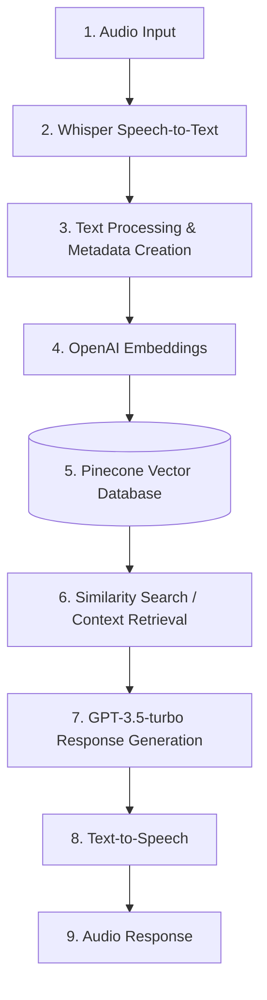

# Memoro II — Conversational Memory Assistant

Memoro II is a Python-based conversational memory assistant designed to listen to conversations, transcribe them, and provide contextual answers based on previously stored data. Developed at the Artificial Intelligence and Data Analytics Lab (AIDA Lab) at Prince Sultan University (PSU), it utilizes OpenAI's GPT-3.5-turbo and Whisper models alongside Pinecone's vector database to retrieve relevant information and assist users by answering queries accurately.

## Technical Highlights

- **Retrieval-Augmented Generation (RAG)**
- **Vector similarity search** with Pinecone
- **OpenAI embeddings** (`text-embedding-ada-002`)
- **Whisper speech recognition** for high-accuracy speech-to-text
- **LLM-based contextual response generation**
- **Text-to-speech interaction** for seamless audio output
- **Persistent conversational memory** using vector-based retrieval
- **Python-based audio processing pipeline**

## Architecture

Memoro II utilizes a multi-step pipeline for end-to-end conversational AI:



By storing transcribed conversations as vectorized context in Pinecone, the system can retrieve the most relevant information when the user asks a question, enabling persistent conversational memory.

## Installation

### Prerequisites

- Python 3.7 or later
- `pip` package manager
- FFmpeg (required for audio processing)

### Setup

1. **Clone the repository:**
   ```bash
   git clone https://github.com/MuddassirKhalidi/MEMORO---II.git
   cd MEMORO---II
   ```

2. **Install dependencies:**
   ```bash
   pip install -r requirements.txt
   ```

3. **FFmpeg Installation**
   - **Windows:** Download from the FFmpeg Official Website, extract, and add the `bin` directory to your System PATH environment variables.
   - **macOS:** `brew install ffmpeg`
   - **Linux (Ubuntu/Debian):** `sudo apt update && sudo apt install ffmpeg`

4. **Set up environment variables:**
   Create a `.env` file in the project root:
   ```env
   OPENAI_API_KEY=your-openai-api-key
   PINECONE_API_KEY=your-pinecone-api-key
   ```
   *(Ensure `.env` is never committed to version control)*

## Usage

1. **Microphone Device Selection:**
   The `PyAudio` library requires you to choose an audio input device. The main notebook provides a script to list available devices and select the correct index based on your microphone's name.

2. **Run the Notebooks:**
   Open the primary Jupyter notebook in the `memoro-ii` directory and run the cells sequentially to initialize the models and establish the Pinecone connection.

3. **Start a Conversation:**
   Run the main execution cell to start recording audio. Wait for a period of silence to end the recording.

4. **Process Context and Query:**
   The recorded audio is automatically transcribed and upserted into the Pinecone database. You can then query the assistant to retrieve answers based on the conversational memory, which will be generated and spoken aloud.

## Code Overview

- **`get_OPENAI_API()` & `get_PINECONE_API()`:** Manages API credentials.
- **`list_audio_devices()` & `get_device_index_by_name()`:** Selects the appropriate audio input hardware.
- **`getAudio()`:** Records audio in chunks until silence is detected.
- **`speech_to_text()`:** Converts recorded `.wav` files to text via Whisper.
- **`create_metadata()`:** Formats sentence metadata with a sliding window approach for better retrieval context.
- **`upsert_vectors()`:** Embeds text and upserts into Pinecone.
- **`process_context()`:** E2E orchestration from speech recording to Pinecone upserting.
- **`get_prompt()`:** Transcribes a user's question, embeds it, and fetches the most relevant context from Pinecone.
- **`process_prompt()`:** Prompts GPT-3.5-turbo with the retrieved context and user query, generating a response.
- **`text_to_speech()` & `play_audio()`:** Converts the LLM's text response into audio and plays it.

## Acknowledgements

- [OpenAI](https://www.openai.com) for GPT-3.5-turbo, text-embedding-ada-002, and Whisper.
- [Pinecone](https://www.pinecone.io) for vector database services.
- [NLTK](https://www.nltk.org) for NLP utilities.
- [PyAudio](https://people.csail.mit.edu/hubert/pyaudio/) & [playsound](https://github.com/TaylorSMarks/playsound) for audio handling.
